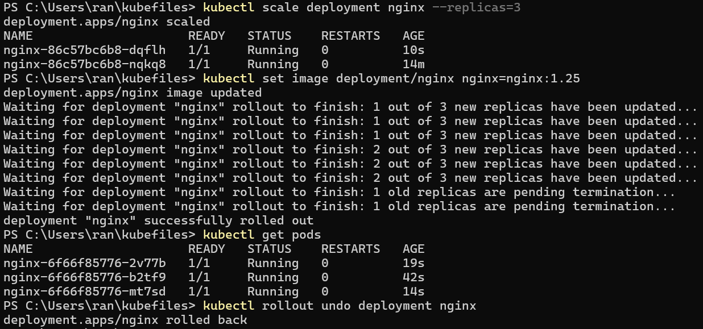

# k8s-03

## Scaling and Updating Applications in Kubernetes

- Scale the application (run multiple copies for high availability).
  - multiple copies (called replicas) to handle more users and provide fault tolerance.

```sh
kubectl scale deployment nginx --replicas=3
```

- Update the application change the version of Nginx
without downtime (this is called a rolling update).

```sh
kubectl set image deployment/nginx nginx=nginx:1.25
```

- Rolling Back Changes
If the update breaks something, we can rollback to the previous version.

```sh
kubectl rollout undo deployment nginx
```


